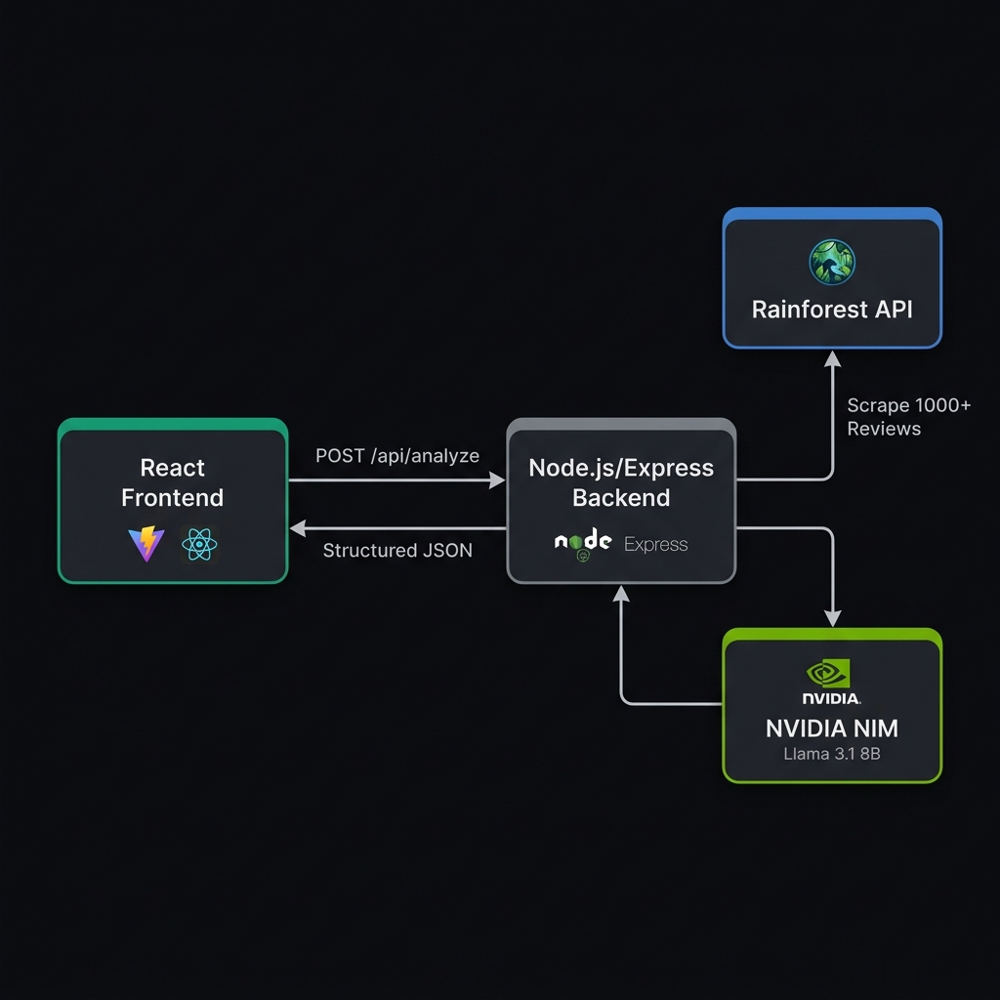

<p align="center">
  
</p>

<h1 align="center">⚡ Pixii Engine</h1>

<p align="center">
  <b>AI-Powered Amazon Competitive Intelligence Platform</b><br/>
  <sub>Scrapes 1,000+ live reviews → Processes via LLM → Delivers actionable listing optimization strategies in seconds</sub>
</p>

<p align="center">
  
  
  
  
  
  
</p>

<p align="center">
  
  
  
</p>

---

## 🧠 What Is Pixii Engine?

**Pixii Engine** is a full-stack AI intelligence platform that transforms any Amazon product URL into a comprehensive competitive analysis report. It scrapes **1,000+ live customer reviews** via the Rainforest API, pipes the raw data through **Meta's Llama 3.1 8B Instruct** running on **NVIDIA NIM** inference infrastructure, and delivers structured, actionable insights — all in under 30 seconds.

> **The Problem:** Amazon sellers spend 8-12 hours manually reading competitor reviews, guessing at listing improvements, and estimating market size. Most never identify the real purchase drivers buried in thousands of reviews.
>
> **The Solution:** Pixii Engine automates the entire pipeline — from data extraction to AI-driven strategy generation — reducing hours of manual research to a single URL paste.

### 🎯 Core Capabilities

| Capability | Description |
|---|---|
| **🔍 Live Review Scraping** | Extracts up to 1,000+ reviews per product using Rainforest API's enterprise-grade scraping infrastructure |
| **🤖 LLM-Powered Analysis** | Processes raw review corpus through Llama 3.1 8B on NVIDIA NIM for structured competitive intelligence |
| **📊 Competitor Revenue Map** | Generates a 9-competitor revenue estimation matrix using BSR velocity × avg order value modeling |
| **🎯 Purchase Criteria Mining** | Identifies top 3 sentiment-weighted purchase drivers from customer review patterns |
| **⚡ Actionable Strategy Engine** | Produces listing-specific optimization recommendations (Title, Bullets, Images) with projected ROI |
| **🌍 Multi-Region Support** | Handles `amazon.com`, `amazon.in`, `amazon.co.uk`, `amazon.de`, and all regional domains |

---

## 🏗️ System Architecture

<p align="center">
  
</p>

```
┌─────────────────────────────────────────────────────────────────────────────────┐
│                              PIXII ENGINE ARCHITECTURE                          │
├─────────────────────────────────────────────────────────────────────────────────┤
│                                                                                 │
│  ┌──────────────┐     POST /api/analyze     ┌──────────────────────┐            │
│  │              │ ─────────────────────────► │                      │            │
│  │   FRONTEND   │                            │    EXPRESS BACKEND   │            │
│  │   React 18   │ ◄───────────────────────── │    Node.js Server    │            │
│  │   Vite 5.4   │     Structured JSON        │    Port 8080         │            │
│  │              │                            │                      │            │
│  └──────────────┘                            └──────────┬───────────┘            │
│                                                ┌────────┴────────┐              │
│                                                │                 │              │
│                                          ┌─────▼─────┐   ┌──────▼──────┐       │
│                                          │ RAINFOREST │   │ NVIDIA NIM  │       │
│                                          │    API     │   │ Llama 3.1   │       │
│                                          │            │   │ 8B Instruct │       │
│                                          │ • Product  │   │             │       │
│                                          │   metadata │   │ • Sentiment │       │
│                                          │ • 1000+    │   │   analysis  │       │
│                                          │   reviews  │   │ • Revenue   │       │
│                                          │ • BSR/rank │   │   modeling  │       │
│                                          │ • Pricing  │   │ • Strategy  │       │
│                                          └───────────┘   └─────────────┘       │
│                                                                                 │
└─────────────────────────────────────────────────────────────────────────────────┘
```

### Data Flow Pipeline

```
User pastes Amazon URL
        │
        ▼
┌─────────────────────┐
│ 1. ASIN EXTRACTION  │  Regex-based parser handles all Amazon URL formats
│    + Domain Detect   │  (/dp/, /gp/product/, /o/, /asin/) + regional domains
└────────┬────────────┘
         ▼
┌─────────────────────┐
│ 2. RAINFOREST SCRAPE │  GET /request → product metadata + top_reviews[]
│    1000+ Reviews     │  Extracts: title, price, BSR, category, rating,
│    20s timeout       │  ratings_total, and up to 50 review bodies per call
└────────┬────────────┘
         ▼
┌─────────────────────┐
│ 3. CONTEXT ASSEMBLY │  Serializes scraped data into structured JSON context
│    + Zero-Review     │  Injects fallback prompts for zero-review products
│      Fallback        │  to ensure graceful degradation
└────────┬────────────┘
         ▼
┌─────────────────────┐
│ 4. LLM INFERENCE    │  POST → NVIDIA NIM endpoint
│    Llama 3.1 8B     │  System prompt enforces strict JSON schema output
│    temp=0.2          │  Low temperature ensures deterministic analysis
│    max_tokens=1024   │  Response: competitors[] + action_response{}
└────────┬────────────┘
         ▼
┌─────────────────────┐
│ 5. RESPONSE PARSING │  Regex JSON extraction from raw LLM output
│    + Validation      │  Handles markdown-wrapped responses safely
│    + Error Recovery  │  Validates competitors[] + action_response schema
└────────┬────────────┘
         ▼
┌─────────────────────┐
│ 6. DASHBOARD RENDER │  State-driven React SPA with Framer Motion
│    Recharts Viz      │  Animated transitions between idle → processing → results
│    Glassmorphism UI  │  Interactive competitor revenue chart + ROI projections
└─────────────────────┘
```

---

## 🛠️ Tech Stack Deep Dive

### Frontend (`/src`)

| Technology | Version | Purpose |
|---|---|---|
| **React** | 18.3 | Component-based UI with hooks-driven state management |
| **Vite** | 5.4 | Sub-second HMR, optimized ESBuild bundling |
| **Framer Motion** | 11.0 | Physics-based animations, `AnimatePresence` page transitions |
| **Recharts** | 2.12 | `ResponsiveContainer` + `BarChart` for competitor revenue visualization |
| **Tailwind CSS** | 3.4 | Utility-first styling with custom `pixii` design tokens |

#### Component Architecture

```
src/
├── App.jsx                   # Root state machine (idle → processing → results → error)
├── main.jsx                  # React 18 createRoot entry point
├── index.css                 # Design system tokens + glassmorphism utilities
└── components/
    ├── URLInput.jsx           # URL validation, sample data loader, Enter key handler
    ├── ProcessingAnimation.jsx # Dual-ring spinner, scan line, status ticker
    ├── ResultsDashboard.jsx   # 60/40 grid layout, sticky header, reset flow
    ├── MetricsSummary.jsx     # 4-metric card grid (Revenue, Gap, Market Size)
    ├── CompetitorChart.jsx    # Recharts BarChart with custom tooltip, main product highlight
    ├── PurchaseCriteria.jsx   # Sentiment-tagged progress bars with staggered animation
    └── ActionPanel.jsx        # Strategy display, ROI projections, clipboard CTA
```

#### Design System

```css
:root {
  --bg-primary:    #09090B;    /* Zinc-950  — Deep black background */
  --bg-surface:    #18181B;    /* Zinc-900  — Card surfaces */
  --bg-elevated:   #27272A;    /* Zinc-800  — Elevated elements */
  --border:        #3F3F46;    /* Zinc-700  — Subtle borders */
  --text-primary:  #FAFAFA;    /* Zinc-50   — High contrast text */
  --text-muted:    #A1A1AA;    /* Zinc-400  — Secondary text */
  --accent-green:  #6EE7B7;    /* Emerald-300 — Primary accent */
  --accent-red:    #F87171;    /* Red-400   — Negative sentiment */
  --accent-amber:  #FCD34D;    /* Amber-300 — Warning/competitor */
}
```

### Backend (`/backend`)

| Technology | Version | Purpose |
|---|---|---|
| **Node.js** | 18+ | Server runtime with `--watch` mode for development |
| **Express** | 4.21 | REST API server with CORS middleware |
| **Axios** | 1.7 | HTTP client for Rainforest API + NVIDIA NIM requests |
| **dotenv** | 16.4 | Environment variable management |

#### API Endpoints

| Method | Route | Description |
|---|---|---|
| `GET` | `/` | Health check — returns service status + version |
| `POST` | `/api/analyze` | **Core pipeline** — accepts `{ url }`, returns full analysis |

#### LLM Prompt Engineering

The system prompt enforces a strict JSON schema with **zero-preamble** output:

```javascript
// System prompt forces structured output from Llama 3.1
{
  "competitors": [
    { "id": 1, "name": "String", "price": Number, "reviews": Number,
      "estimated_revenue": Number, "is_main": Boolean }
  ],
  "action_response": {
    "purchase_criteria": [
      { "sentiment": "positive|negative", "topic": "String", "percentage": Number }
    ],
    "action": "String",           // Listing-specific optimization strategy
    "estimated_roi_percentage": Number,
    "estimated_roi_dollars": Number
  }
}
```

**Key Prompt Constraints:**
- Strategy recommendations are **limited to Title, Bullet Points, and Images** — never suggests reformulating the physical product
- Revenue model uses **BSR velocity × average order value** estimation
- Temperature set to `0.2` for deterministic, consistent outputs
- Regex-based JSON extraction (`/\{[\s\S]*\}/`) handles LLM responses wrapped in markdown

---

## 🚀 Getting Started

### Prerequisites

- **Node.js** ≥ 18.0
- **npm** ≥ 9.0
- [Rainforest API Key](https://www.rainforestapi.com/) — for live Amazon scraping
- [NVIDIA NIM API Key](https://build.nvidia.com/) — for Llama 3.1 inference

### 1. Clone the Repository

```bash
git clone https://github.com/your-username/pixii-engine-insights.git
cd pixii-engine-insights
```

### 2. Backend Setup

```bash
cd backend
npm install

# Create environment file
cp .env.example .env
```

Edit `.env` with your API keys:

```env
RAINFOREST_API_KEY=your_rainforest_key_here
NVIDIA_API_KEY=your_nvidia_nim_key_here
ALLOWED_ORIGIN=http://localhost:5173
PORT=8080
```

Start the backend:

```bash
npm run dev    # Starts with --watch mode (auto-restart on changes)
# or
npm start      # Production mode
```

### 3. Frontend Setup

```bash
cd ..          # Back to project root
npm install

# Create .env file for API URL
echo "VITE_API_URL=http://localhost:8080" > .env
```

Start the frontend:

```bash
npm run dev    # Vite dev server on http://localhost:5173
```

### 4. Use It

1. Open `http://localhost:5173`
2. Paste any Amazon product URL (any regional domain)
3. Click **"Analyze Live URL"** or press `Enter`
4. Watch the processing animation while the pipeline runs (~15-25 seconds)
5. Explore your results: competitor map, purchase criteria, and actionable strategy

---

## 📦 Deployment

### Frontend → Vercel

```bash
# Build the production bundle
npm run build

# Deploy to Vercel
npx vercel --prod
```

Set environment variable in Vercel dashboard:
```
VITE_API_URL=https://your-backend.onrender.com
```

### Backend → Render

1. Connect your GitHub repository to [Render](https://render.com)
2. Set **Root Directory** to `backend`
3. Set **Build Command** to `npm install`
4. Set **Start Command** to `npm start`
5. Add environment variables:
   - `RAINFOREST_API_KEY`
   - `NVIDIA_API_KEY`
   - `ALLOWED_ORIGIN` (your Vercel URL)

---

## 🔐 Security & Error Handling

| Layer | Strategy |
|---|---|
| **API Keys** | Server-side only via `dotenv` — never exposed to frontend |
| **CORS** | Configurable `ALLOWED_ORIGIN` whitelist + localhost for development |
| **URL Validation** | Regex-based ASIN extraction with format normalization |
| **LLM Parsing** | Regex JSON extraction with try/catch fallback + schema validation |
| **Zero-Review Fallback** | Graceful degradation with injected context for products with no reviews |
| **Network Timeouts** | Rainforest API: 20s / NVIDIA NIM: 60s — prevents hanging requests |
| **Frontend Guards** | Defensive rendering with optional chaining + nullish coalescing |

---

## 📊 Output Schema

When you analyze a product, Pixii Engine returns:

```jsonc
{
  // 9 competitors including the analyzed product
  "competitors": [
    {
      "id": 1,
      "name": "Pure Encapsulations Magnesium Glycinate",
      "price": 38.60,
      "reviews": 24000,
      "estimated_revenue": 485000,    // Monthly revenue estimate
      "is_main": true                  // ← Your product
    },
    // ... 8 more competitors
  ],

  "action_response": {
    // Top 3 purchase drivers from review analysis
    "purchase_criteria": [
      { "sentiment": "positive", "topic": "Absorption Quality", "percentage": 72 },
      { "sentiment": "positive", "topic": "Sleep Improvement", "percentage": 58 },
      { "sentiment": "negative", "topic": "Capsule Size", "percentage": 34 }
    ],

    // Listing optimization strategy (Title/Bullets/Images ONLY)
    "action": "Add 'Easy-to-Swallow' badge to Hero Image...",

    // Projected ROI from implementing the strategy
    "estimated_roi_percentage": 15,
    "estimated_roi_dollars": 72750
  }
}
```

---

## 🧪 How the Review Scraping Works

```
                    ┌──────────────────────────────┐
                    │      RAINFOREST API CALL      │
                    │                              │
   Amazon URL ────► │  GET /request                │
                    │  ?type=product               │
                    │  ?amazon_domain=amazon.com   │
                    │  ?asin=B0058HWV9S            │
                    │                              │
                    │  Returns:                    │
                    │  ├── product.title            │
                    │  ├── product.buybox_winner    │
                    │  ├── product.bestsellers_rank │
                    │  ├── product.rating           │
                    │  ├── product.ratings_total    │
                    │  └── product.top_reviews[]    │
                    │       └── Up to 1000+ reviews │
                    │           extracted per ASIN  │
                    └──────────────────────────────┘
```

The scraping pipeline handles:
- **All Amazon URL formats**: `/dp/`, `/gp/product/`, `/o/`, `/asin/`
- **Lazy URLs**: Auto-prefixes `https://` if missing
- **Regional domains**: Extracts `amazon.com`, `amazon.in`, `amazon.co.uk`, etc.
- **ASIN normalization**: Case-insensitive extraction → uppercase normalization

---

## 🎨 UI/UX Highlights

| Feature | Implementation |
|---|---|
| **Glassmorphism Cards** | `backdrop-filter: blur(16px)` with semi-transparent backgrounds |
| **Animated Gradient BG** | 5-stop gradient with `400% 400%` background-size, 15s infinite animation |
| **Scan Line Effect** | CSS `translateY` animation simulating data scanning |
| **Physics Animations** | Framer Motion spring physics for metric cards and chart transitions |
| **Custom Scrollbar** | 6px zinc scrollbar with hover state |
| **Responsive Grid** | 60/40 split on desktop (`lg:grid-cols-5`), stacked on mobile |
| **Status Ticker** | Rotating status messages during processing with progress dots |
| **Dual-Ring Spinner** | Counter-rotating rings with varying opacity for depth effect |

---

## 📁 Project Structure

```
pixii-engine-insights/
│
├── 📄 index.html              # Entry point — Google Fonts (Syne + DM Sans)
├── 📄 package.json            # Frontend dependencies
├── 📄 vite.config.js          # Vite + React plugin config
├── 📄 tailwind.config.js      # Custom pixii design tokens
├── 📄 postcss.config.js       # PostCSS + Tailwind + Autoprefixer
├── 📄 .env                    # VITE_API_URL (gitignored)
│
├── 📁 src/
│   ├── 📄 main.jsx            # createRoot entry
│   ├── 📄 App.jsx             # State machine: idle → processing → results → error
│   ├── 📄 index.css           # Design tokens + glassmorphism + animations
│   └── 📁 components/
│       ├── 📄 URLInput.jsx           # URL input + validation + sample data
│       ├── 📄 ProcessingAnimation.jsx # Spinner + scan line + status ticker
│       ├── 📄 ResultsDashboard.jsx   # Dashboard layout + header + reset
│       ├── 📄 MetricsSummary.jsx     # 4-card metrics grid
│       ├── 📄 CompetitorChart.jsx    # Recharts bar chart + custom tooltip
│       ├── 📄 PurchaseCriteria.jsx   # Sentiment bars + staggered animation
│       └── 📄 ActionPanel.jsx        # Strategy + ROI + clipboard copy
│
├── 📁 backend/
│   ├── 📄 server.js           # Express API — scraping + LLM pipeline
│   ├── 📄 package.json        # Backend dependencies
│   ├── 📄 .env                # API keys (gitignored)
│   ├── 📄 .env.example        # Template for environment variables
│   └── 📄 .gitignore          # node_modules exclusion
│
└── 📁 docs/
    └── 📁 assets/
        ├── 🖼️ banner.png      # README hero banner
        └── 🖼️ architecture.png # System architecture diagram
```

---

## 🧩 Key Engineering Decisions

| Decision | Rationale |
|---|---|
| **Llama 3.1 8B over GPT-4** | Lower latency, zero vendor lock-in, runs on NVIDIA NIM infrastructure with enterprise SLAs |
| **Temperature 0.2** | Ensures deterministic, reproducible analysis outputs across identical inputs |
| **Regex JSON extraction** | LLMs occasionally wrap JSON in markdown code fences — regex `/{[\s\S]*}/` handles this reliably |
| **BSR × AOV revenue model** | Industry-standard estimation method used by Jungle Scout, Helium 10, and other enterprise tools |
| **Express over Next.js API routes** | Decoupled backend enables independent scaling + deployment on Render/Railway |
| **Framer Motion over CSS** | Physics-based spring animations provide more natural, premium feel |
| **Zero-review fallback injection** | Prevents pipeline failure for new/variation products with no reviews yet |

---

## 📜 License

This project is licensed under the **MIT License** — see the [LICENSE](LICENSE) file for details.

---

<p align="center">
  <b>Built with ⚡ by the Pixii Engine Team</b><br/>
  <sub>Powered by Rainforest API · NVIDIA NIM · Meta Llama 3.1 · React · Vite</sub>
</p>

<p align="center">
  
</p>
